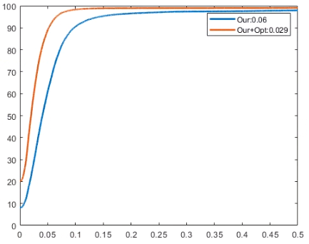

# Correspondence Learning via Linearly-invariant Embedding

This repository is the official implementation of [Correspondence Learning via Linearly-invariant Embedding](https://arxiv.org/abs/2030.12345)

This code was written by [Marie-Julie Rakotosaona](http://www.lix.polytechnique.fr/Labo/Marie-Julie.RAKOTOSAONA/) and [Riccardo Marin](http://profs.scienze.univr.it/~marin/).

## Requirements

### Prerequisites:
* CUDA and CuDNN
* Python 2.7
* Tensorflow 1.15


## Pre-trained Models

You can download pretrained models here:

- [Pretrained model](https://nuage.lix.polytechnique.fr/index.php/s/kZP65iLt5M9H7Hq/download)


Download pretrained models from code:
``` bash
cd pretrained_models
python download_models.py
```
## Dataset


- [Our dataset](https://nuage.lix.polytechnique.fr/index.php/s/22YrGsJ7M4dx7Ay/download)

Download dataset from code:
``` bash
cd data
python download_data.py
```


## Training

To train the basis model:

```train basis model
python src/train_basis.py --log_dir "path to basis model directory"
```

To train the transformation model:


```train transformation model
python src/train_descriptors.py --log_dir "path to transformation model directory" --model_path "path to basis model"
```

## Evaluation

To evaluate a model, you can use the "test.py" file. For example, to evaluate the pre-trained model on the Noise dataset:

Run pretrained model on testset:
```eval
python .\src\test.py --i FAUST_noise_0.01 -n log_model --epoch=4427
```

## Results

The evaluation of the correspondence for point clouds generated from the FAUST dataset without or with additional noise as mean error, with cumulative curves and a qualitative example.


| Method         | No noise  | Noise |
| ------------------ |---------------- | -------------- |
| our  |    5.4e-2         |      6.6e-2       |
| GFM  |    2.9e-1         |      3.4e-1       |
| Uni20  |  7.5e-2         |      8.5e-2       |
| Uni60 |   6.9e-2         |      8.1e-2       |
| 3DC |     7.0e-2         |      7.3e-2       |
| FMAP |    1.3e-1         |      1.4e-1       |
| FMAP+ZOO |1.1e-1         |      1.3e-1       |
| GFM+ZOO | 3.1e-1         |      3.8e-1       |

To replicate our evaluation, you can run the "evaluation.m" in Matlab. It is already configurated to run on the output of pre-trained model.
In the paper we computed the geodesic distance matrices using an old pre-compiled .mex file for fastmarch algorithm. For the moment (and for the sake of semplicity), in this git we attached a pre-computed geodesic distance matrix used for all the pairs. It is an approximation, but this will let you run the evaluation. This should return to you a plot like this:



## Citation
If you use our work, please cite our paper.


[](https://creativecommons.org/licenses/by-nc/4.0/)

This work is licensed under a [Creative Commons Attribution-NonCommercial 4.0 International License](http://creativecommons.org/licenses/by-nc/4.0/). For any commercial uses or derivatives, please contact us.
